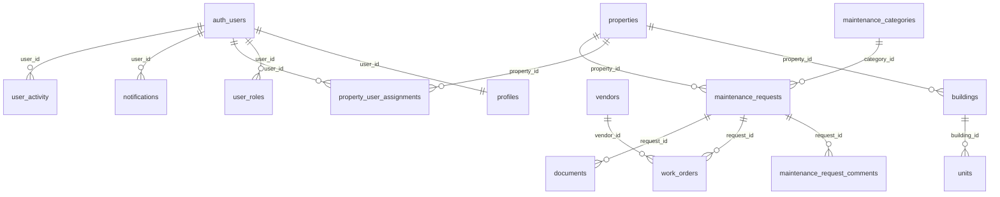

# Database schema

All schema lives in `supabase/migrations/` (apply in order 001 → 007).

## Entity relationships

## Tables

| Table | Purpose |
|-------|---------|
| `profiles` | App-level user profile (1:1 with `auth.users`, created by trigger `handle_new_user`) |
| `user_roles` | RBAC — many roles per user, `app_role` enum |
| `properties` / `buildings` / `units` | Property hierarchy |
| `property_user_assignments` | Links users to properties as manager / resident / technician / vendor (drives most RLS) |
| `maintenance_categories` | Request categories (seeded) |
| `maintenance_requests` | Core workflow entity; status/priority enums; DB trigger audits status & assignment changes |
| `maintenance_request_comments` | Threaded discussion |
| `work_orders` | Executable work derived from a request; assignable to technicians or vendors |
| `vendors` | External service companies (optionally linked to a login) |
| `documents` | Metadata for files in the private `maintenance-files` bucket |
| `property_payment_settings` | UPI/bank details shown to residents, one row per property |
| `expense_categories` / `expenses` | Building running costs, manager/admin visibility only |
| `monthly_dues` | Per-unit, per-month amount owed/paid; residents see only their own unit's rows via `resides_in_unit()` |
| `notifications` | In-app notifications (system-written via admin client) |
| `user_activity` | Append-only audit log (update/delete blocked by trigger) |

## Conventions

UUID PKs (`gen_random_uuid()`), FKs with explicit cascade behavior,
`created_at`/`updated_at` (maintained by `set_updated_at()` trigger), check
constraints on enums/lengths/amounts, unique constraints
(`profiles.user_id`, `buildings(property_id,name)`,
`units(building_id,unit_number)`, `user_roles(user_id,role)`), and indexes
on all FK columns plus hot query paths (status, assigned_to, created_at,
activity action/entity).

## RLS helper functions

`has_role(role)`, `is_admin()`, `is_manager()`,
`is_assigned_to_property(pid)`, `manages_property(pid)`, `resides_in_unit(unit_id)` — all `SECURITY
DEFINER` + `STABLE`, so policies can consult `user_roles` /
`property_user_assignments` without recursive RLS evaluation.

## Access matrix (summary)

| Table | resident | technician | property/maintenance manager | admin |
|---|---|---|---|---|
| profiles | own | own | read all | read all |
| properties | assigned read | assigned read | read/write | full |
| maintenance_requests | own CRUD (open) | assigned read/update | property scope | full |
| work_orders | — | assigned | property scope | full |
| notifications | own | own | own | own |
| user_activity | own read | own read | own read | read all |

### Finance access

Residents may read `monthly_dues` rows only for units where they hold a
`resident` relationship in `property_user_assignments` (`resides_in_unit()`).
They cannot read `expenses` or other units' `monthly_dues` at all — those
policies check `is_manager()` / `manages_property()` only. Writes to
`monthly_dues`, `expenses` and `property_payment_settings` are manager/admin
only; a DB trigger audits every change to `amount_paid`.

Inserts to `user_activity` and `notifications` happen only via the
server-side admin client or `SECURITY DEFINER` triggers.
